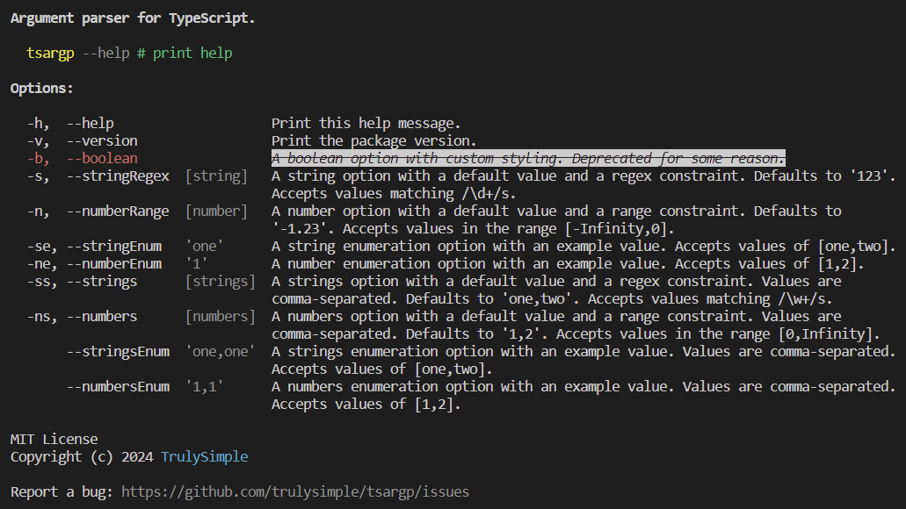

# tsargp



## Features

- Fully declarative style with type checking
- Boolean, string, number and function types
- Value constraints (enums, regex and range)
- Help message formatting with proper wrapping
- Wide range of display attributes from [SGR]
- Zero-dependency and small footprint (7KB)

## Demo

```sh
npm install -g tsargp
tsargp -h  # print the help message
tsargp     # see the options' default values
tsargp ... # play with option values
```

See the [source](lib/demo.ts).

## Usage

```sh
npm install -D tsargp
```

```ts
import { type Options, ArgumentParser } from 'tsargp';

const options = {
  // define options' attributes...
} as const satisfies Options;

const values = new ArgumentParser(options).parse();
// use `asyncParse` if you declare async fuction options
```

## Build

```sh
curl -fsSL https://bun.sh/install | bash
bun install
bun run dist
```

## Publish

```sh
wget -qO- https://raw.githubusercontent.com/nvm-sh/nvm/v0.39.7/install.sh | bash
nvm install --lts && nvm use --lts
npm publish
```

[SGR]: https://www.wikiwand.com/en/ANSI_escape_code#SGR_(Select_Graphic_Rendition)_parameters